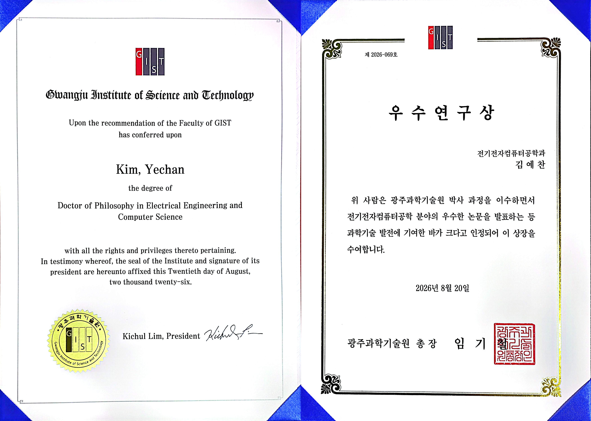
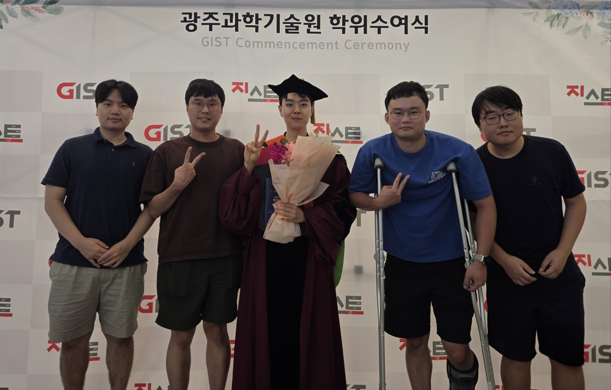

Yechan Kim earned his **Ph.D.** from the School of Electrical Engineering and Computer Science at GIST on August 20, 2026. 
In recognition of his outstanding research achievements, he was also selected to represent the School and received the **Outstanding Research Award** from the President of GIST.

