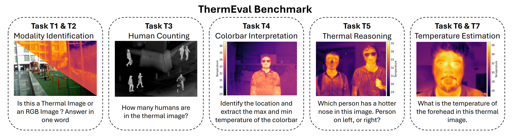

오늘 읽어볼 논문:
- Shrivastava, Ayush, et al. "ThermEval: A Structured Benchmark for Evaluation of Vision-Language Models on Thermal Imagery." Proceedings of the 32nd ACM SIGKDD Conference on Knowledge Discovery and Data Mining. 2026.

## 요약

- `ThermEval-B`라는 벤치마크와 `ThermEval-D`라는 데이터셋을 제안한다.

    - 참고
        - 벤치마크: 모델 성능을 공정하게 비교하기 위한 평가 체계 전체
            - 즉, 벤치마크 = 데이터 + 태스크 + 평가 메트릭
        - 데이터셋: 학습이나 평가에 사용하는 데이터 자체

- 위 벤치마크 및 데이터셋을 이용하여, 현재 존재하는 Vision-Language Model (VLM) 대부분이 RGB 이미지는 잘 이해하지만, 열화상 이미지에서 ``**온도**라는 물리량''을 실제로 이해하고 추론하는 능력은 상당히 부족하다는 사실을 밝힌다.

## 연구 동기

열화상 영상은 RGB와 본질적으로 다릅니다. RGB는 색과 질감 (Texture)를 담습니다. 반면, 열화상 영상은 **온도 (Temperature)** 및 **복사 (Emitted Radiation) 에너지**를 표현합니다.
따라서 열화상 영상에서는 단순히 객체를 인식 (Object Recognition)하는 것만이 중요하지 않죠. 대신 다음과 같은 **Physical Grounding**(- 모델이 열화상 영상에 관측된 신호를 실제 온도/복사 물리량과 연결해 해석하는 능력 -)도 필요합니다:

- 이것이 진짜 열화상 영상인가?
- 열화상 영상이 따르는 컬러 바 (팔레트)는?
- 사람 A와 사람 B 중 누가 더 뜨거운가?
- 특정 픽셀 및 신체 부위의 온도는 얼마인가?

기존에는 이러한 역량을 평가하는 벤치마크가 없었습니다. 이에 따라 저자들은 `ThermEval-B`라는 벤치마크를 제안합니다.

## ThermEval-B: 벤치마크

ThermEval-B 벤치마크는 아래 3가지 데이터셋을 활용합니다:

- FLIR [1] (기존 RGB-열화상 쌍 데이터셋) 
- LLVIP [2] (기존 RGB-열화상 쌍 데이터셋)
- ThermEval-D (저자가 제안하는 추가 열화상 데이터셋)
  - ThermEval-D는 뒤에서 자세히 설명합니다.

위 세 데이터셋을 바탕으로 저자들은 총 7개 Task, 약 55.9K VQA 샘플로 벤치마크를 구성하였습니다.

| Task | 질문 | 사용 데이터셋 |
| --- | --- | --- |
| T1 | Thermal인가? RGB인가? | FLIR, LLVIP (RGB-T 쌍 모두 사용) |
| T2 | Colormap이 바뀌어도 Thermal임을 알아보는가? | FLIR, LLVIP (T만 활용) |
| T3 | Thermal Image에서 People Counting을 잘 하는가? | FLIR, LLVIP (T만 활용) |
| T4 | Color Bar를 찾고 Min/Max Temperature를 읽는가? | ThermEval-D |
| T5 | 어느 사람이 더 뜨거운가? 또, 어느 신체 부위 (이마/코/...)가 더 뜨거운가? | ThermEval-D |
| T6 | 특정 Pixel/Region의 절대 온도를 추정할 수 있는가? | ThermEval-D |
| T7 | 촬영 거리 변화에 강건한 온도 추정이 가능한가? | ThermEval-D |

## ThermEval-D: 데이터셋

저자들은 기존에 공개된 열화상 데이터셋들이 실제 **Pixel-Level Temperature Ground Truth**가 없다는 점을 지적합니다.

그래서 저자들은 ThermEval-D 데이터셋을 구축했습니다:

- 35명 성인을 섭외하여 실내/외에서 1,000장의 열화상 영상 취득;
- Pixel별 Temperature (즉, $(x, y) \rightarrow T [^\circ C]$) 정보 제공;
- 이마 / 코 / 가슴 / 사람 세그멘테이션 Annotation 실시.

## VLM 벤치마킹 실험

### - 사용한 VLM 모델

25개 VLM = 17개 오픈소스 모델, 4개 클로즈드 소스 모델, 3개의 오픈소스 차트 특화 모델, 1개의 특별하게 미세조정된 오픈소스 모델

| 모델 | 파라미터 크기 | 비고 |
| --- | --- | --- |
| InternVL 3 [3] (CVPR 24, 상하이AI연구소) | 8B, 14B, 38B | 오픈소스 |
| LLaVA 1.5 [4] (ICCV 25, 베이징대학교) | 7B | 오픈소스 |
| LLaMA 3.2 [5] (Arxiv 24, Meta) | 11B | 오픈소스 |
| MiniCPM-V 2.6 [6] (Nature Communications 25, 청화대) | 8B | 오픈소스 |
| Phi-3 [7] (Arxiv 24, Microsoft) | 4.2B | 오픈소스 |
| Phi-3.5 [7] | 7B | 오픈소스 |
| Qwen-VL [8] (Arxiv 23, Alibaba) | 7B | 오픈소스 |
| Qwen-VL 2.5 | 7B, 33B | 오픈소스 |
| Qwen A22 | 235B | 오픈소스 |
| PaliGemma-2 [9] (Arxiv 24, Google DeepMind) | 3B | 오픈소스 |
| IDEFICS-3 [10] (Arxiv 24, HuggingFace) | 6.7B | 오픈소스 |
| Smol-VLM [11] (Arxiv 25, HuggingFace) | 256M | 오픈소스 |
| Jina-VLM [12] (ICLR-W 26, Jina AI) | 2.4B | 오픈소스 |
| BLIP-2 [13] (ICML 23, Salesforce) | 9B | 오픈소스 |
| Gemini 3 Pro [14-15] (Google DeepMind) | - | 클로즈드 |
| Gemini 3 Flash | - | 클로즈드 |
| Gemini 2.5 Pro | - | 클로즈드 |
| Gemini 2.5 Flash | - | 클로즈드 |
| ChartGemma [16] (COLING 25) | 3B | 오픈소스 (차트 특화) |
| ChartInstruct LLaMA-2 [17] (ACL-F 24) | 7B | 오픈소스 (차트 특화) |
| TinyCharts [18] (EMNLP 24) | 3B | 오픈소스 (차트 특화) |
| Qwen-VL 2.5 | 7B | 오픈소스 (저자가 직접 파인튜닝) |

## 참고문헌

1. Teledyne FLIR. "Flir adas dataset: Thermal-visible fusion for autonomous driving." https://oem.flir.com/en-in/solutions/automotive/adas-dataset-form/, 2024.
2. Jia, Xinyu, et al. "LLVIP: A visible-infrared paired dataset for low-light vision." IEEE/CVF International Conference on Computer Vision Workshops (ICCVW). 2021.
3. Chen, Zhe, et al. "Internvl: Scaling up vision foundation models and aligning for generic visual-linguistic tasks." Proceedings of the IEEE/CVF Conference on Computer Vision and Pattern Recognition (CVPR). 2024.
4. Xu, Guowei, et al. "Llava-cot: Let vision language models reason step-by-step." IEEE/CVF International Conference on Computer Vision (ICCV). 2025.
5. Grattafiori, Aaron, et al. "The llama 3 herd of models." arXiv:2407.21783 (2024).
6. Yao, Yuan, et al. "Efficient GPT-4V level multimodal large language model for deployment on edge devices." Nature Communications 16.1 (2025): 5509.
7. Abdin, Marah, et al. "Phi-3 Technical Report: A Highly Capable Language Model Locally on Your Phone." arxiv:2404.14219 (2024).
8. Bai, Jinze, et al. "Qwen-VL: A versatile vision-language model for understanding, localization, text reading, and beyond." arXiv:2308.12966 (2023).
9. Steiner, Andreas, et al. "Paligemma 2: A family of versatile vlms for transfer." arXiv:2412.03555 (2024).
10. Laurençon, Hugo, et al. "Building and better understanding vision-language models: insights and future directions." arXiv:2408.12637 (2024).
11. Marafioti, Andrés, et al. "Smolvlm: Redefining small and efficient multimodal models." arXiv:2504.05299 (2025).
12. Koukounas, Andreas, et al. "Jina-VLM: Small Multilingual Vision Language Model." DATA-FM Workshop @ ICLR 2026.
13. Li, Junnan, et al. "Blip-2: Bootstrapping language-image pre-training with frozen image encoders and large language models." International Conference on Machine Learning (ICML). 2023.
14. Team, Gemini, et al. "Gemini: a family of highly capable multimodal models." arXiv:2312.11805 (2023).
15. Team, Gemini, et al. "Gemini 1.5: Unlocking multimodal understanding across millions of tokens of context." arXiv:2403.05530 (2024).
16. Masry, Ahmed, et al. "Chartgemma: Visual instruction-tuning for chart reasoning in the wild." International Conference on Computational Linguistics (COLING). 2025.
17. Masry, Ahmed, et al. "Chartinstruct: Instruction tuning for chart comprehension and reasoning." Findings of the Association for Computational Linguistics (ACL Findings). 2024.
18. Zhang, Liang, et al. "TinyChart: Efficient chart understanding with program-of-thoughts learning and visual token merging." Conference on Empirical Methods in Natural Language Processing (EMNLP). 2024.